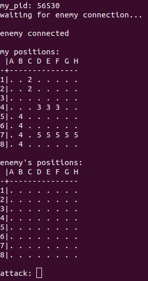
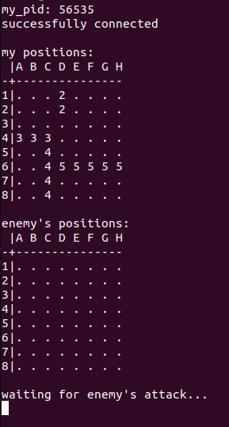
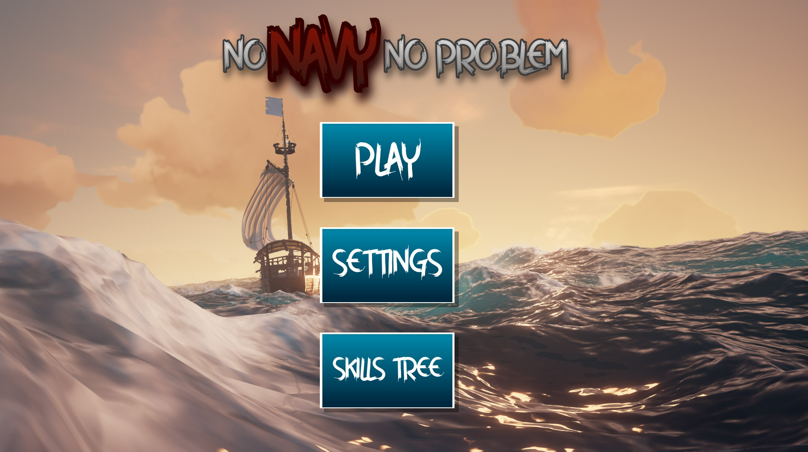
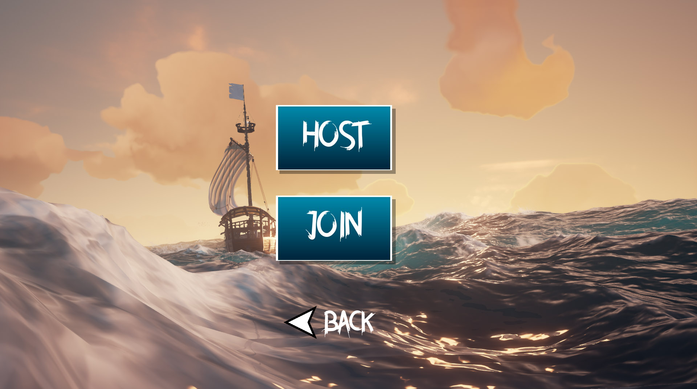
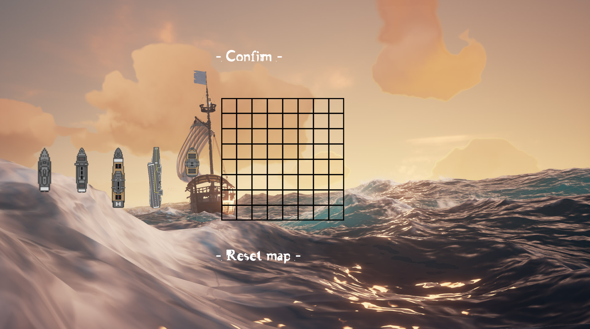
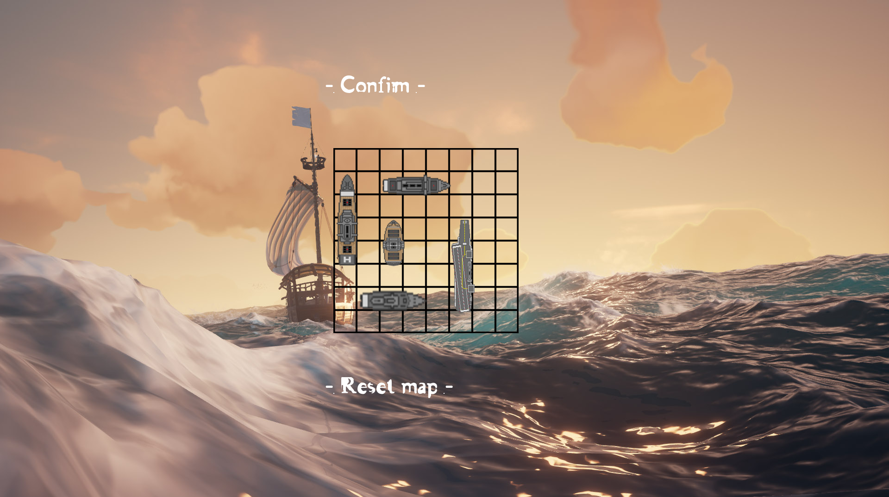
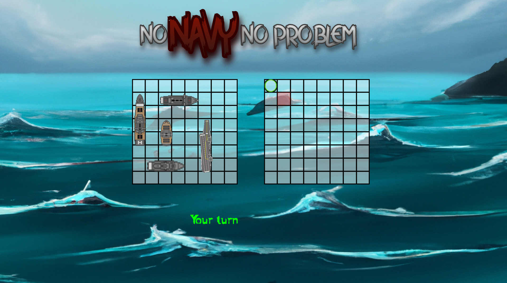

# <span style="color:lightblue">Project : Navy</span>
### <span style="color:grey">EPITECH PROJECT, 2023</span>
### <span style="color:grey">Made by Aurélien BARAQUIN and Louis ROLLET</span>

# <span style="color:lightblue">Description:</span>

<span style="color:lightgrey">This project is a game where you have to destroy all the ennemies ships before they destroy yours.</span>


# <span style="color:lightblue">How to play:</span>

## Launch the game:
<span style="color:lightgrey">Player one :</span>
```./navy [navy_position]```

<span style="color:lightgrey">Player two :</span>
```./navy [navy_position] [pid]```

## Navy position:
<span style="color:lightgrey">The navy position is a file that contains the position of your ships.</span>

<span style="color:lightgrey">The file must be like this :</span>
```
2:C1:C2
3:D4:F4
4:B5:B8
5:D7:H7
```

<span style="color:lightgrey">The first number is the size of the ship, the second is the position of the first part of the ship and the third is the position of the last part of the ship.</span>

## PID:
<span style="color:lightgrey">The PID is the process id of the other player. You can find it in the first line of the other player's terminal.</span>


## How to play:
<span style="color:lightgrey">You can play with the keyboard. By entering the coordinates of the position you want to attack. Like this : </span>```A1```

## How to win:
<span style="color:lightgrey">You win when you destroy all the ennemies ships.</span>

## How to lose:
<span style="color:lightgrey">You lose when all your ships are destroyed.</span>

## How to compile:
```make``` <span style="color:lightgrey">or</span>
 ```make re```

## How to clean the project:
```make fclean```

# <span style="color:lightblue">Bonus :</span>

## CSFML bonus:
### <span style="color:lightcyan">How to play with the bonus:</span>
<span style="color:lightgrey">Go to the bonus folder named CSFML and compile the project with</span>
 ```make``` <span style="color:lightgrey">or</span> ```make re```.
    
<span style="color:lightgrey">Then launch the game with</span> ```./navy```.

<span style="color:lightgrey">Then play with a friend on another computer by chosing to host a party or to join one. </span>

<span style="color:lightgrey">If the IP is not found when hosting you can install ifconfig by doing :</span> ```sudo apt-get install net-tools``` 

<span style="color:lightgrey">You can find the IP ans PORT of the other player on the screen of the CSFML window.</span>

<span style="color:lightgrey">if you have any other question, you can do </span>```./navy -h``` <span style="color:lightgrey">to get help.</span>

### <span style="color:lightcyan">How to play:</span>
<span style="color:lightgrey">You can play with the mouse.</span>

### <span style="color:lightcyan">How to win:</span>
<span style="color:lightgrey">You win when you destroy all the ennemies ships.</span>

### <span style="color:lightcyan">How to lose:</span>
<span style="color:lightgrey">You lose when all your ships are destroyed.</span>

# <span style="color:lightblue">Screenshots:</span>
## Navy:
### <span style="color:lightcyan">Waiting for the other player:</span> ```./navy pos1```
```
my_pid:  56530
waiting for enemy connection...

```
### <span style="color:lightcyan">Waiting for the other player:</span> ```./navy pos2 56530```
```
my_pid:  56535
successfully connected

```
### <span style="color:lightcyan">Player 1 POV:</span>

### <span style="color:lightcyan">Player 2 POV:</span>


## Bonus CSFML:
### <span style="color:lightcyan">Menu:</span>

### <span style="color:lightcyan">Choose menu:</span>

### <span style="color:lightcyan">Place boat:</span>

### <span style="color:lightcyan">An example of a map:</span>

### <span style="color:lightcyan">Game:</span>


# <span style="color:lightblue">List of features:</span>
- [x] <span style="color:lightgrey">Dinamic button</span>
- [x] <span style="color:lightgrey">shadow of button</span>
- [x] <span style="color:lightgrey">clickable button</span>
- [x] <span style="color:lightgrey">settings/slider</span>
- [x] <span style="color:lightgrey">epic music</span>
- [x] <span style="color:lightgrey">networking with socket</span>
- [x] <span style="color:lightgrey">can host or join a party</span>
- [x] <span style="color:lightgrey">Ingame map creation</span>
- [x] <span style="color:lightgrey">can rotate ship on the map</span>
- [x] <span style="color:lightgrey">Back button</span>
- [x] <span style="color:lightgrey">Ship sprite, background sprite</span>
- [x] <span style="color:lightgrey">Turn getion</span>
- [x] <span style="color:lightgrey">real time display</span>
- [x] <span style="color:lightgrey">win condition</span>
- [x] <span style="color:lightgrey">"-h" enable</span>
- [ ] <span style="color:lightgrey">ability tree (coming soon)</span>

# <span style="color:lightblue">Authors:</span>
-  [<span style="color:orange">Aurélien Baraquin</span>](https://github.com/AurelienBaraquin)
- [<span style="color:orange">Louis Rollet</span>](https://github.com/Louis-rollet)
  
